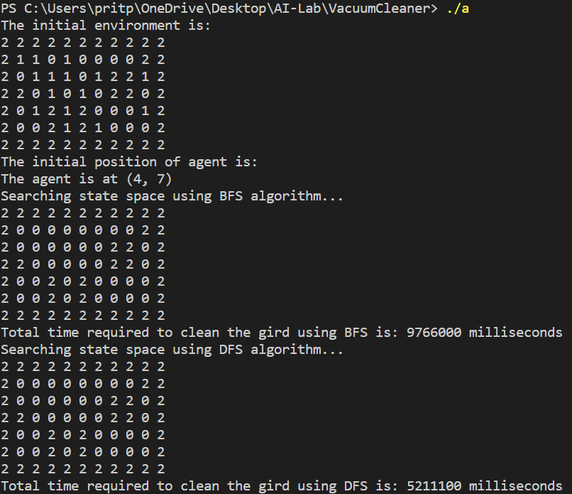
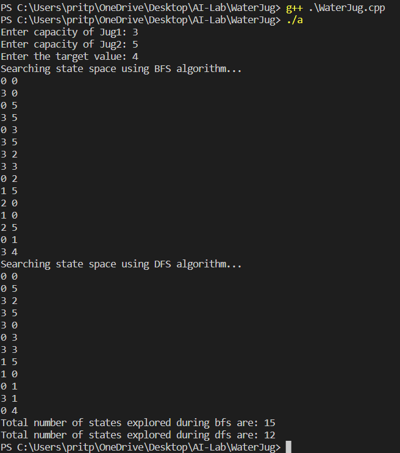

# 8-Puzzle

## Input

```
vector<vector<int>> initial = {{-1, 2, 3}, {1, 8, 4}, {7, 6, 5}};
```

## Output


# Vacuum Cleaner Agent

## Output

Case I: When solution is possible



Case II: When solution is Not possible


# Water Jug Problem

## Input

```
Enter capacity of Jug1: 3
Enter capacity of Jug2: 5
Enter the target value: 4
```

## Output

