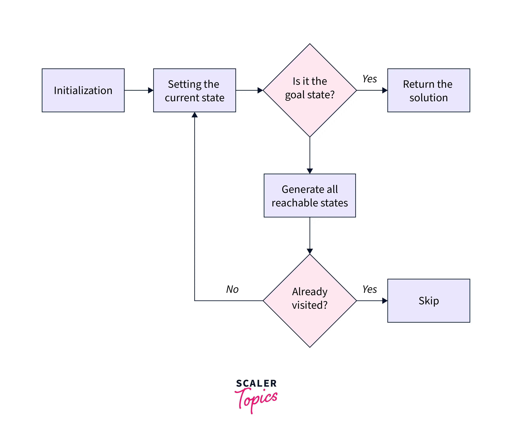

# State Space Search

## Introduction


## Results

1. Vacuum Cleaner Agent

The environment is created randomly. Even the initial state is choosen randomly. In general, DFS outperforms BFS.

2. Water Jug problem

Consider input as

```cpp
Enter capacity of Jug1: 3
Enter capacity of Jug2: 5
Enter the target value: 4
```

* Total number of states explored during bfs are: ```15```
* Total number of states explored during dfs are: ```12```

3. 8-Puzzle

Consider initial configuration as 
```cpp
//-1 represents blank
vector<vector<int>> initial = {{6, -1, 2}, {1, 8, 4}, {7, 3, 5}};
```

* No. of states explored using BFS: ```2428```
* No. of states explored using DFS: ```75333```


